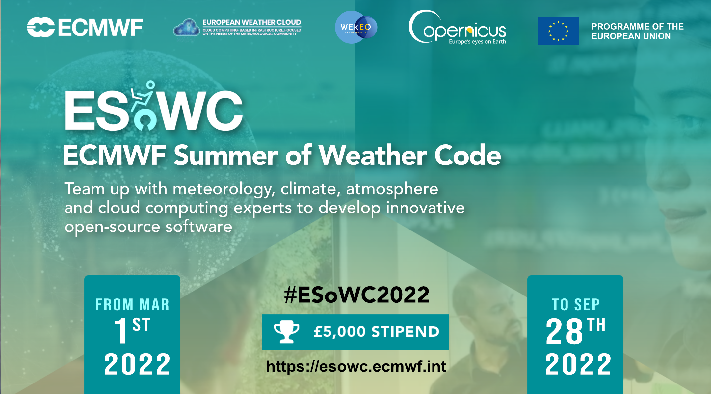

# ECMWF Summer of Weather Code 2022

**ECMWF Summer of Weather Code brings innovation and open-source developments to the Earth science community**. It is a collaborative programme where each summer several developer teams team up with mentors from ECMWF to work on innovative weather-, climate- and atmosphere-related software developments and applications.
 

ESoWC is organised by the [European Centre for Medium-Range Weather Forecasts (ECMWF)](https://www.ecmwf.int/) and supported by [Copernicus](https://climate.copernicus.eu).
 

</img>

 

## ESoWC 2022 Challenges

There are three challenge streams:

</img>

### Stream 1 - Software development for weather, climate and atmosphere

 

* [Challenge 11<strong>*</strong> - Think small, move fast *(funded under Copernicus)*]()
* [Challenge 12<strong>*</strong> - Predicting heat waves in computing applications - towards greener applications *(funded under Copernicus)*]()
* [Challenge 13<strong>*</strong> - Atmospheric Datasets Comparison (ADC) Toolbox evolution *(fundend under Copernicus)*)]()

 

</img> 

### Stream 2 - Web development for weather, climate and atmosphere

 

* [Challenge 21 - A new map viewer for ECMWF's meteorological WMS Server]()
* [Challenge 22 - Bring Magics weather maps to Matplotlib]()
* [Challenge 23 - ECMWF user dashboard]()
* [Challenge 24 - CliMetLab web application]()
* [Challenge 25 - Integrated support documentation]()

 

</img>

### Stream 3 - Applied data science for weather, climate and atmosphere

 

* [Challenge 31 - Flood forecasting: the power of citizen science]()
* [Challenge 32 - Wildfire Emission Explorer]()

 

<i><strong>*</strong> Challenge is funded under Copernicus. Only nationals from European Union (EU) Member States and countries associated with EU’s Space Programme (currently Iceland and Norway) are eligible to participate (see [Terms and Conditions](https://esowc.ecmwf.int/terms-and-conditions)).</i>

*Note: Successful projects will be eligible for a stipend of £ 5000 and if applicable, cloud credits from the [European Weather Cloud](https://www.europeanweather.cloud/) or [WEkEO](https://wekeo.eu/)*

 

## How it works

### 1. Application period: 1 Mar - 15 Apr 2022
Browse through the [ESoWC 2022 challenges](https://github.com/esowc/challenges_2022/issues), ask questions and together with the mentors, tailor your proposal. Apply before 15 April 2022.

### 2. Announcement of selected proposals: 29 Apr 2022
The selected ESoWC 2022 project teams will be announced on 29 Apr 2022.

### 3. Coding period: 2 May  - 31 Aug 2022
The 4-month long coding period starts 2 May 2022 and lasts until 31 August 2022. During this time, the selected teams team up with experienced ECMWF mentors and experts in weather, climate and atmosphere.   Follow the progress of the projects here on Github.

### 4. Final ESoWC day: 28 September 2022
The ESoWC day is a celebratory closure of the programme. Each ESoWC team will be be invited to present their project results.

 

## Important links
* [ESoWC Frequently Asked Questions](http://esowc.ecmwf.int/FAQ)
* [ESoWC Terms & Conditions](http://esowc.ecmwf.int/terms-and-conditions)
* Follow ESoWC on [Twitter](https://twitter.com/esowc_ecmwf), [LinkedIn](https://www.linkedin.com/showcase/ecmwf-summer-of-weather-code/) and [YouTube](https://www.youtube.com/channel/UCWLn6evyZ6tTktvUSTE1Xow)
* Read a summary of ESoWC 2021 on the ECMWF Science Blog: [ECMWF Summer of Weather Code 2021](https://www.ecmwf.int/en/about/media-centre/science-blog/2021/ecmwf-summer-weather-code-2021)
* ECMWF Newsletter: [ECMWF Summer of Weather Code drives open-source developments and innovation](https://www.ecmwf.int/en/newsletter/169/news/ecmwf-summer-weather-code-drives-open-source-developments-and-innovation)
