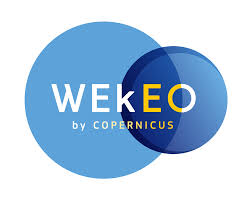

# ECMWF Summer of Weather Code 2022

**ECMWF Summer of Weather Code brings innovation and open-source developments to the Earth science community**. It is a collaborative programme where each summer several developer teams team up with mentors from ECMWF to work on innovative weather-, climate- and atmosphere-related software developments and applications.
 

ESoWC is organised by the [European Centre for Medium-Range Weather Forecasts (ECMWF)](https://www.ecmwf.int/) and supported by [Copernicus](https://climate.copernicus.eu).
 

</img>

 

## ESoWC 2022 Projects
Congratulations to the eight teams that have been selected to be part of ECMWF Summer of Weather Code 2022:

| Project title | Team | Mentors |
| ---------- | --------------- | -------------- |
| [**Flood forecasting: the power of citizen science (Team A)**]()| [Emiliana Myftari]()   [Beatrice Rinaldi]()   [Enxhi Sulkja]() | [Marie-Ameilie Boucher]()   [Cinzia Mazzetti]()   [Florian Pappenberger]()   [Jan Seibert]()   [Juan Colonese]() |
| [**Flood forecasting: the power of citizen science (Team B)**]()| [Mohit Anand]() | [Marie-Ameilie Boucher]()   [Cinzia Mazzetti]()   [Florian Pappenberger]()   [Jan Seibert]()   [Juan Colonese]() |
| [**Adjusting Climate Projections**]()| [Jakob Wessel]()   [Fiona Spuler]() | [Edward Comyn-Platt]()   [Chiara Cagnazzo]()   [James Varndell]() |
| [**CliMetLab web application**]() |[Akshaj Verma]()  |[Baudouin Raoult](https://github.com/b8raoult)   [Florian Pinault](https://github.com/floriankrb) |
| [**Wildfire Emission Explorer**]() |[Giovanni Paolini]()  [Ainhoa Murillo Iraola]() | [Mark Parrington]()   [Sebastien Garrigues]()   [James Varndell]()   [Miha Razinger](https://github.com/miha-at-ecmwf) |
| [**ECMWF user dashboard**]() | [Adarsh Pandey]() | [Sylvie Lamy-Thepaut](https://github.com/sylvielamythepaut)   [Eduard Rosert]() |
| [**Atmospheric Datasets Comparison (ADC) Toolbox evolution**](https://github.com/esowc/adc-toolbox) | [Alba Vilanova Cortezon](https://github.com/albavilanova) | [Miha Razinger](https://github.com/miha-at-ecmwf)   [Antje Inness]()   [Federico Fierli]() |
| [**Bringing Magics Weather maps to Matplotlib**]() | [Alish Dipani]() | [James Varndell]()   [Sylvie Lamy-Thepaut](https://github.com/sylvielamythepaut)  [Stephan Siemen](https://github.com/stephansiemen)   [Baudouin Raoult](https://github.com/b8raoult) |

 
 

Generous cloud computing ressources are provided by: 
|the Copernicus DIAS service [WEkEO](https://www.wekeo.eu/) |[European Weather Cloud](https://www.europeanweather.cloud/)|
|----------------|:--------------------:|
|</img>|</img>|

 

 

## How it works

### 1. Application period: 1 Mar - 15 Apr 2022
Browse through the [ESoWC 2022 challenges](https://github.com/esowc/challenges_2022/issues), ask questions and together with the mentors, tailor your proposal. Applications closed on 15 April 2022.

### 2. Announcement of selected proposals: 29 Apr 2022
The selected ESoWC 2022 project teams will be announced on 29 Apr 2022.

### 3. Coding period: 2 May  - 31 Aug 2022
The 4-month long coding period starts 2 May 2022 and lasts until 31 August 2022. During this time, the selected teams team up with experienced ECMWF mentors and experts in weather, climate and atmosphere.   Follow the progress of the projects here on Github.

### 4. Final ESoWC day: 28 September 2022
The ESoWC day is a celebratory closure of the programme. Each ESoWC team will be be invited to present their project results.

 

## Important links
* [ESoWC Frequently Asked Questions](http://esowc.ecmwf.int/FAQ)
* [ESoWC Terms & Conditions](http://esowc.ecmwf.int/terms-and-conditions)
* Follow ESoWC on [Twitter](https://twitter.com/esowc_ecmwf), [LinkedIn](https://www.linkedin.com/showcase/ecmwf-summer-of-weather-code/) and [YouTube](https://www.youtube.com/channel/UCWLn6evyZ6tTktvUSTE1Xow)
* Read a summary of ESoWC 2021 on the ECMWF Science Blog: [ECMWF Summer of Weather Code 2021](https://www.ecmwf.int/en/about/media-centre/science-blog/2021/ecmwf-summer-weather-code-2021)
* ECMWF Newsletter: [ECMWF Summer of Weather Code drives open-source developments and innovation](https://www.ecmwf.int/en/newsletter/169/news/ecmwf-summer-weather-code-drives-open-source-developments-and-innovation)
